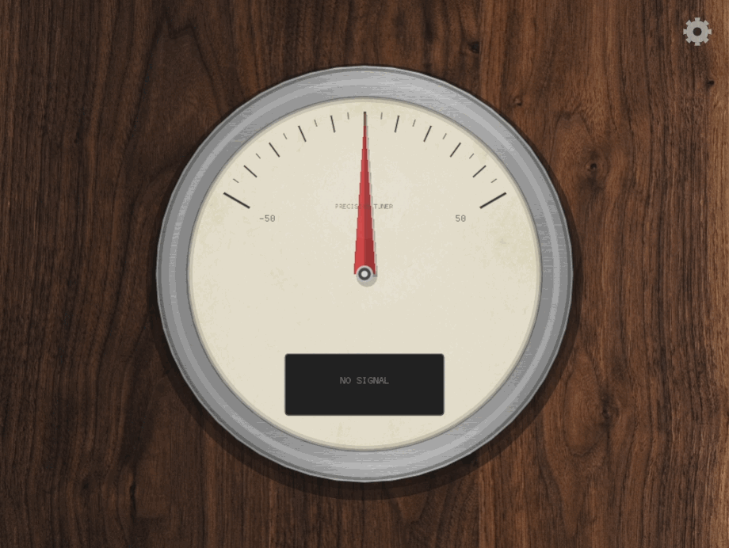

# Precision Guitar Tuner

[](https://github.com/Konstantysz/precision-guitar-tuner/releases/latest)
[](https://github.com/Konstantysz/precision-guitar-tuner/actions/workflows/build.yml)
[](https://github.com/Konstantysz/precision-guitar-tuner/actions/workflows/tests.yml)
[](https://github.com/Konstantysz/precision-guitar-tuner/actions/workflows/static-analysis.yml)
[](LICENSE)
[](https://en.cppreference.com/w/cpp/20)
[]()

> Professional-grade desktop guitar tuner with ±0.1 cent accuracy and native audio interface support

<p align="center">
  
</p>

**📖 [Quick Start Guide](docs/QUICK_START.md)** | **📚 [User Guide](docs/USER_GUIDE.md)** | **🔧 [Developer Docs](CLAUDE.md)** | **🗺️ [Roadmap](docs/ROADMAP.md)**

---

## Overview

**Precision Tuner** is a modern C++20 desktop application that delivers studio-quality guitar tuning with professional accuracy. Built for musicians who demand precision, it supports professional audio interfaces, achieves ultra-low latency, and offers advanced visualization modes.

### Key Features

- ⚡ **±0.1 cent accuracy** - Competitive with hardware tuners and Peterson StroboSoft
- 🎛️ **Professional audio interface support** - Works with Rocksmith cable, Focusrite, MOTU, RME, and all USB audio devices
- 🖥️ **Cross-platform** - Native builds for Windows, macOS, and Linux
- 🎯 **Ultra-low latency** - <10ms end-to-end on ASIO/CoreAudio/ALSA (Optimized Input Path)
- 💎 **Premium Retro Gauge** - High-quality vector rendering with realistic wood, chrome, and glass materials
- 🎸 **Multiple tuning modes** - Standard, drop, chromatic, and custom tunings
- ⌨️ **Keyboard shortcuts** - 11 shortcuts for hands-free operation (Space, D, P, R, B, M, arrows, F11, F1)
- 💡 **Interactive tooltips** - Context-sensitive help for all 13 settings controls
- 📖 **Help menu** - Quick Start Guide, User Guide, keyboard shortcuts overlay, and About dialog
- 📊 **Real-time spectrum analyzer** - Visualize harmonics and overtones
- 📦 **Automated Builds** - CI/CD pipeline generating installers for Windows, macOS, and Linux
- 🆓 **GPL-free dependencies** - Commercial-friendly licensing (MIT/BSD)

### Why Desktop Over Mobile?

Mobile apps are limited by:

- ❌ Consumer-grade microphones (ambient noise interference)
- ❌ No professional audio interface support
- ❌ Limited accuracy (typically ±1-3 cents)
- ❌ Small screens for precision work
- ❌ Cannot integrate with DAWs

**Precision Tuner** solves all these issues with native desktop audio APIs and professional-grade DSP.

## Technology Stack

- **Language**: C++20 (modern features, zero-cost abstractions)
- **UI Framework**: [kappa-core](https://github.com/Konstantysz/kappa-core) (OpenGL-based)
- **Audio I/O**: RtAudio (ASIO/CoreAudio/ALSA support)
- **DSP**: PFFFT + YIN/MPM pitch detection algorithms
- **Build System**: CMake 3.20+ with vcpkg

## Quick Start

### Prerequisites

- **C++20 compiler**: MSVC 19.28+, GCC 10+, or Clang 11+
- **CMake**: 3.20 or later
- **Git**: For submodule management
- **vcpkg**: C++ package manager

### Phase 3: Enhanced UI & Features (In Progress)

- [x] External GLSL shaders
- [x] TrueType font rendering
- [x] Configuration persistence (JSON)
- [x] Responsive window layout
- [x] Settings layer (basic UI)
- [x] Multiple tuning modes (Standard, Drop D, Open G, DADGAD, Chromatic)
- [x] Audio device selection (separate input/output)
- [x] Audio feedback (reference tones, input monitoring)
- [x] Input gain control
- [x] **Premium Visual Overhaul** (Textures, Materials, Lighting)
- [x] **Keyboard shortcuts** (11 shortcuts for audio feedback, navigation, and controls)
- [x] **Tooltips** (13 interactive controls with keyboard shortcuts)
- [x] **Help menu** (Quick Start, User Guide, About dialog, keyboard shortcuts overlay)
- [ ] Spectrum analyzer (optional)

### Phase 4: Advanced Tuning (In Progress)

- [x] Hybrid pitch detection (YIN/MPM)
- [x] MPM pitch detector implementation
- [x] Harmonic rejection (octave error correction)
- [x] Fine-tuned YIN parameters for guitar
- [x] Drone mode (continuous reference tone)
- [x] Polyphonic mode (chord playback)
- [ ] Visual feedback improvements

## 🛠️ Building from Source

### Prerequisites

- **CMake** (3.21+)
- **C++20 Compiler** (MSVC 19.30+, GCC 11+, Clang 13+)
- **Vulkan SDK** (required for GLFW/OpenGL context creation on some systems)

### Build Instructions

```bash
# Clone the repository with submodules
git clone --recursive https://github.com/Konstantysz/precision-guitar-tuner.git
cd precision-guitar-tuner

# Configure with CMake (using vcpkg toolchain)
# Windows PowerShell:
cmake -B build -S . -DCMAKE_BUILD_TYPE=Release -DCMAKE_TOOLCHAIN_FILE="$env:VCPKG_ROOT/scripts/buildsystems/vcpkg.cmake"

# Linux/macOS:
cmake -B build -S . -DCMAKE_BUILD_TYPE=Release -DCMAKE_TOOLCHAIN_FILE="$VCPKG_ROOT/scripts/buildsystems/vcpkg.cmake"

# Build the project
cmake --build build --config Release

# Run the tuner
./build/bin/Release/PrecisionGuitarTuner
```

### Running Tests

The project uses Google Test for unit testing.

```bash
# Run all tests
ctest --test-dir build -C Release --output-on-failure
```

## 🤝 Contributing

Contributions are welcome! Please feel free to submit a Pull Request.

1. Fork the repository
2. Create your feature branch (`git checkout -b feature/AmazingFeature`)
3. Commit your changes (`git commit -m 'Add some AmazingFeature'`)
4. Push to the branch (`git push origin feature/AmazingFeature`)
5. Open a Pull Request

## 📄 License

This project is licensed under the MIT License - see the [LICENSE](LICENSE) file for details.

## 🙏 Acknowledgments

- **YIN Algorithm**: For robust pitch detection
- **OpenGL**: For high-performance graphics
- **ImGui**: For debug UI (if used)
- **stb_truetype**: For font rendering

```
precision-guitar-tuner/
├── external/                       # Git submodules
│   ├── kappa-core/                # Application framework (OpenGL, layers, events)
│   ├── lib-guitar-io/             # Audio I/O abstraction (RtAudio wrapper)
│   ├── lib-guitar-dsp/            # DSP algorithms (PFFFT, YIN)
│   └── stb/                       # stb_truetype single-header library
├── src/
│   ├── PrecisionGuitarTuner.cpp   # Application entry point
│   ├── Layers/                    # Layer implementations (PrecisionTuner::Layers namespace)
│   │   ├── AudioProcessingLayer.h/.cpp      # Real-time audio I/O and pitch detection
│   │   └── TunerVisualizationLayer.h/.cpp   # Visual tuner rendering (OpenGL)
│   └── FontRenderer.h/.cpp        # TrueType font rendering (stb_truetype)
├── assets/
│   └── shaders/                   # GLSL shader files
│       ├── geometry.vert/.frag    # Shape rendering
│       └── text.vert/.frag        # Text rendering
└── .claude/                       # Development documentation
    ├── DEVELOPMENT_PLAN.md        # 11-week roadmap
    └── settings.json              # IDE configuration
```

### Design Principles

- **KISS**: Simple, straightforward implementations
- **YAGNI**: Implement only what's needed now
- **SOLID**: Single responsibility, open/closed principle
- **DRY**: Extract common patterns into reusable components
- **Real-time safety**: No allocations or locks in audio callback
- **Documentation**: Comprehensive Doxygen documentation for all APIs

See [CLAUDE.md](CLAUDE.md) for comprehensive development guidelines.

## Development

### Project Structure

This is part of a planned 4-application guitar software suite:

1. **Precision Tuner** (this project)
2. Precision Metronome (future)
3. Chord Library & Trainer (future)
4. Tab/Sheet Music Viewer (future)

The `lib-guitar-io` and `lib-guitar-dsp` submodules are shared across all applications for maximum code reuse.

### Build Configurations

```bash
# Debug build (with logging and asserts)
cmake -B build-debug -S . -DCMAKE_BUILD_TYPE=Debug
cmake --build build-debug

# Release build (optimized)
cmake -B build-release -S . -DCMAKE_BUILD_TYPE=Release
cmake --build build-release

# Run tests
ctest --test-dir build-release --output-on-failure
```

### Contributing

See [CLAUDE.md](CLAUDE.md) for development guidelines and architecture details.

**Development Documentation:**
- [DEVELOPMENT_PLAN.md](.claude/DEVELOPMENT_PLAN.md) - v1.0.0 release plan and current tasks
- [ROADMAP.md](docs/ROADMAP.md) - Post-launch feature roadmap

## Roadmap

### Phase 0: Repository Setup ✅ COMPLETED

- [x] Project setup and documentation
- [x] CMake build system with vcpkg
- [x] Git submodules architecture
- [x] kappa-core v0.5.1 integration
- [x] Cross-platform builds (Windows/macOS/Linux)

### Phase 1: Audio Engine ✅ COMPLETED

- [x] lib-guitar-io (RtAudio wrapper)
- [x] lib-guitar-dsp (YIN algorithm)
- [x] AudioProcessingLayer implementation
- [x] Real-time pitch detection working
- [x] Console logging of detected notes

### Phase 2: Visual Tuner ✅ COMPLETED

- [x] OpenGL rendering in TunerVisualizationLayer (modern OpenGL 3.3+ with shaders)
- [x] Cent deviation meter (horizontal bar with ±50 cent range)
- [x] Tuning accuracy indicator (color-coded: green/yellow/orange/red)
- [x] Add audio level meter (input gain indicator) with smooth color transitions
- [x] Circular tuning indicator with smooth color transitions
- [x] Note name display with octave (TrueType fonts via stb_truetype)
- [x] Frequency display in Hz
- [x] Precise cent deviation display
- [x] "IN TUNE" indicator with visual feedback

### Phase 3: Enhanced UI & Features (In Progress - 71% Complete)

- [x] **Move shaders to external .glsl files** ✅ COMPLETE
  - `assets/shaders/geometry.vert/.frag` - Shape rendering
  - `assets/shaders/text.vert/.frag` - Text rendering with stb_truetype
  - CMake auto-copy to build directory
- [x] **Configuration persistence** ✅ COMPLETE
  - JSON save/load with nlohmann-json
  - Platform-specific config paths (Windows/macOS/Linux)
- [x] **Responsive window sizing and layout** ✅ COMPLETE
  - Dynamic viewport updates via GLFW framebuffer queries
  - Window size constraints (400×300 min, 3840×2160 max)
  - Config persistence for window dimensions
- [x] **Settings layer (basic UI)** ✅ COMPLETE
  - Settings toggle button in tuner UI
  - Layer visibility control system
  - Ready for device selection controls
- [x] Device switching works without restarts
- [x] Device selection UI (in progress)
- [x] Multiple tuning modes (chromatic, standard, drop D, DADGAD, etc.)
- [ ] Spectrum analyzer (optional - FFT visualization)

**Note:** Strobe tuner deferred to Phase 5 per development plan

### Phase 4: Professional Tools (Future)

- [ ] VST/AU plugin for DAW integration
- [ ] Polyphonic tuning
- [ ] Intonation testing tools
- [ ] Custom temperaments

## Performance Targets

- **Professional Accuracy**: ±0.1 cent accuracy using YIN algorithm (comparable to strobe tuners)
- **Pitch Stabilization**: Advanced smoothing algorithms (Hybrid EMA/Median) for jitter-free readings
- **Real-time Visualization**: Smooth, high-framerate needle and strobe displays
- **Update Rate**: 60 Hz UI refresh
- **CPU Usage**: <5% on modern hardware
- **Memory**: <50 MB resident

## Comparison

| Feature | Precision Tuner | Peterson StroboSoft | Mobile Apps | Hardware Tuners |
|---------|----------------|---------------------|-------------|-----------------|
| **Accuracy** | ±0.1 cent | ±0.1 cent | ±1-3 cents | ±0.5-1 cent |
| **Price** | $39.99 (planned) | $50-100 | $0-10 | $30-150 |
| **Audio Interface** | ✅ Yes | ✅ Yes | ❌ No | N/A |
| **Strobe Mode** | ✅ Yes | ✅ Yes | ❌ No | ✅ Yes (some) |
| **Platform** | Win/Mac/Linux | Win/Mac | iOS/Android | Hardware |
| **DAW Plugin** | 🔄 Roadmap | ✅ Yes | ❌ No | ❌ No |
| **License** | MIT (GPL-free) | Commercial | Varies | N/A |

## License

This project is licensed under the **MIT License** - see [LICENSE](LICENSE) for details.

All dependencies are GPL-free and commercially compatible:

- **kappa-core**: MIT License
- **RtAudio**: MIT-like permissive license
- **PFFFT**: BSD License
- **vcpkg packages**: MIT/BSD/Zlib licenses

## Acknowledgments

- [kappa-core](https://github.com/Konstantysz/kappa-core) - Modern C++20 application framework
- [RtAudio](https://github.com/thestk/rtaudio) - Cross-platform audio I/O
- [PFFFT](https://github.com/marton78/pffft) - Fast FFT implementation
- YIN Algorithm - De Cheveigné & Kawahara (2002)
- McLeod Pitch Method (MPM) - Philip McLeod (2005)

## Support

- **Documentation**: [CLAUDE.md](CLAUDE.md)
- **Development Plan**: [.claude/DEVELOPMENT_PLAN.md](.claude/DEVELOPMENT_PLAN.md)
- **Issues**: [GitHub Issues](https://github.com/yourorg/precision-guitar-tuner/issues)

---

**Status**: 🚧 In Development (Phase 3 In Progress - 71% Complete)

**Latest Release**: v0.0.3-alpha (2025-11-23)

- ✅ Real-time pitch detection operational (YIN algorithm)
- ✅ ±0.1 cent target accuracy
- ✅ Cross-platform audio I/O (ASIO/CoreAudio/ALSA)
- ✅ Modern OpenGL 3.3+ rendering with external GLSL shaders
- ✅ TrueType font rendering (stb_truetype)
- ✅ Color-coded tuning feedback (green/yellow/orange/red)
- ✅ Horizontal cent deviation meter (±50 cents)
- ✅ GPU-accelerated rendering at 60 FPS
- ✅ Configuration persistence (JSON save/load, platform-specific paths)
- ✅ Responsive window sizing (400×300 min, 3840×2160 max)
- ✅ Settings layer with toggle button (basic UI structure)
- 🔄 Device selection controls (Phase 3 - in progress)
- 🔄 Multiple tuning modes (Phase 3)

See [CHANGELOG.md](CHANGELOG.md) for detailed version history.

Built with ❤️ for musicians who demand precision.
